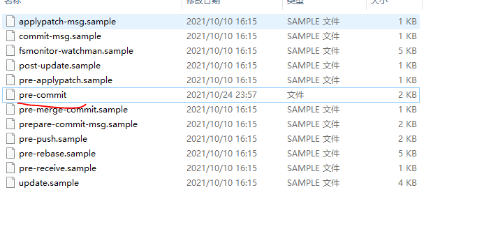
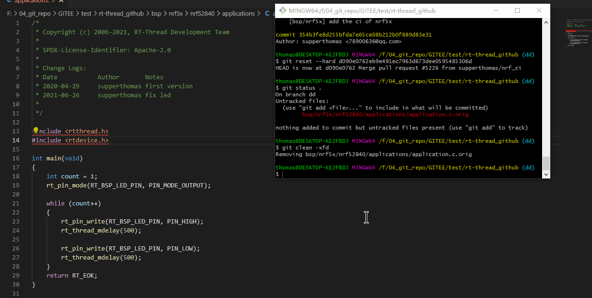

# git_auto_script

## 简介

- 你是否会遇到过忘记使用formatting脚本来整理下代码，导致RTTHREAD PR不通过打回去重新修改？

- 你是否总是忘记整理那些astyle的格式问题，总是提交的代码不够美观？

- 你是否总是有些bug是因为没有经过，导致后面bug一大堆？

来看下这个软件吧，保证对你有一定帮助，而且在做其他项目的时候这个软件包也可以使用。

本软件包通过整合cppcheck（静态编译软件）， astyle(格式化代码)， formatting（RTTHREAD格式整理）

三款软件，将这三款软件整合到git的hook中，让你以后提交代码再也不要担心被CI的formatting检测出问题重新提交了。

本软件一次部署长期有效，只要你的git仓库没有更换，就一直有效。

当然如果有好的建议或者修改，欢迎PR，我们大家一起来维护。

当然也如果有更好的软件或者更好的需求，也欢迎在issue里面提出来。

## 如何使用

第一次使用可能会麻烦一点，不过我觉得这个就是一劳永逸的事情，后面就几乎无感了。

### CPPCHECK

 STEP1: [CPPCHECK官网](http://cppcheck.net/) 下载安装

STEP2: 环境变量path添加cppcheck路径

STEP3:命令行里面执行cppcheck命令，可以用即可

### ASTYLE

STEP1: [ASTYEL官网](https://sourceforge.net/projects/astyle/) 下载解压

STEP2: 环境变量path添加astyle路径

STEP3:命令行里面执行astyle命令，可以用即可

### formatting

这个是来自[formatting.py](https://github.com/mysterywolf/formatting) 的自动化脚本，这边我把这个python脚本整理成exe命令行的形式：


STEP1: 直接clone[git_auto_script](https://github.com/supperthomas/git_auto_script.git)目录

STEP2: 将Windows_exe 文件夹添加到path环境变量中

STEP3: 命令行里面执行formatting 可以用即可

生成exe采用命令(这一步通常不需要操作，如果需要更新的话执行下面操作)

```
pyinstaller --onefile --nowindowed formatting.py
```

### pre-commit安装

将 RTTHREAD_auto/pre-commit拷贝到你的工程的`.git/hook` 文件夹下面，以后commit无需操作任何操作就可以直接commit 无需考虑formatting或者格式问题或者静态检查问题



好了， 一切ready。

这个时候，只要你正常commit，你就会发现，你的代码格式已经经过astyle优化过了，如果代码静态检查有问题，会commit不过，并且提示你需要修改，同时也是经过formatting的修改了。之后再也不用担心PR会有格式上的问题了。




## FAQ

### cppcheck和astyle等命令在哪里可以去掉？

在pre-commit文件夹中，找到cppcheck命令和astyle命令和formatting命令，前面加`#`就可以去掉

如下所示：注释掉所有的命令，就不会执行自动化脚本了

```
if [ -n "$changed_files" ]; then
	#cppcheck --enable=warning,performance,portability --inline-suppr --error-exitcode=1 --force $changed_files
	err=$?
	if [ $err -ne 0 ]; then
	    echo "Hello! we found a obvious fault, please fix the error then commit again"
		exit $err
	fi
fi

# We only filter the file name with c or cpp file.
changed_files=$(git diff-index --cached $against | \
	grep -E '[MA]	.*\.(c|cpp|h)$' | cut -d'	' -f 2)

if [ -n "$changed_files" ]; then
	#astyle --style=allman --indent=spaces=4 --indent=spaces=4 --indent=spaces=4 --pad-header --pad-header --pad-header --align-pointer=name --lineend=linux --convert-tabs --verbose  $changed_files
	#formatting $changed_files
	git add $changed_files
fi
```

  ### commit 之后文件夹下面多出来一些奇怪的文件是否可以去掉

生成一些*.orig文件是由于astyle对文件进行了修改，为了防止改错文件，将源文件做了备份，如果不想要的话可以在astyle命令下面添加下面的选项来去掉：

```
 --suffix=none
```

### cppcheck 的选项的含义

cppcheck选项可以参考官方[manual](http://cppcheck.net/manual.pdf)

astyle 选项参考官方的[astyle option](http://astyle.sourceforge.net/astyle.html)

本项目主要目的是提供一种自动化的commit机制，如果觉得cppcheck机制和astyle机制不好用，可以注释掉或者用其他的命令替换掉，也欢迎提供一些比较好用的免费的方便的软件。

astyle的选项，参考RTTHREAD官方文档

### pre-commit是否可以在主仓库中保留

目前我觉得是无法在仓库中保留的，欢迎大家提出好的idea。我也希望能有好的方法在主仓库保留


